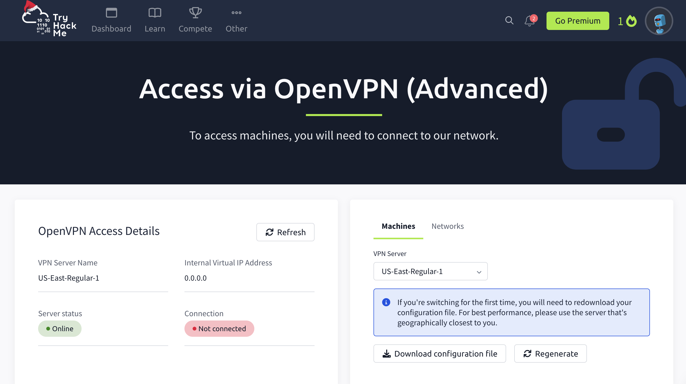
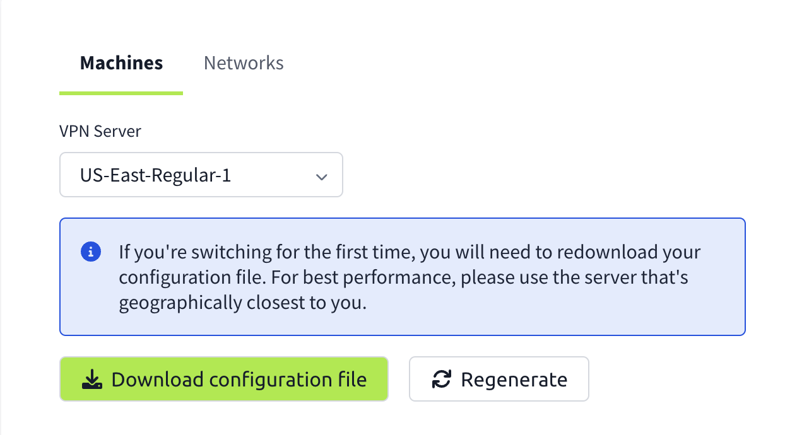
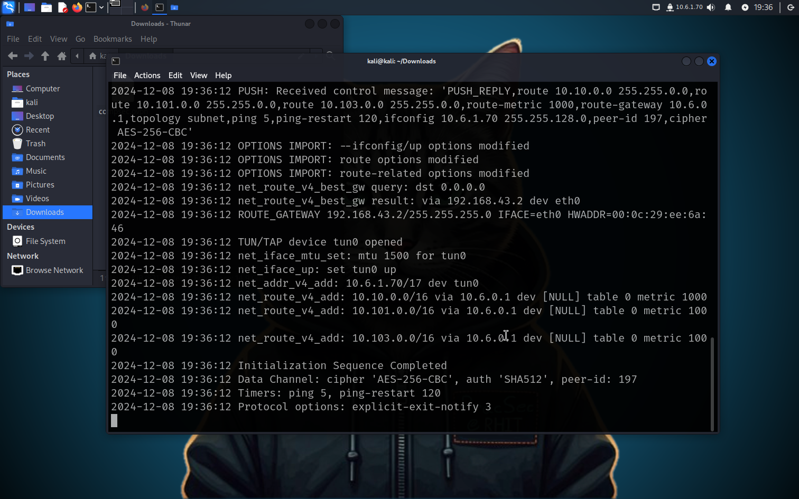
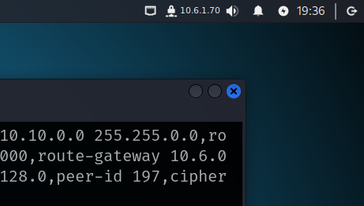

# Setting Up OpenVPN on Kali

Before you start, browse to something like: [Show My IP](https://www.showmyip.com/)


Make a note of this IP address. This is what the rest of the world sees when you talk with them.

Browse to the access page of Try Hack Me [here](https://tryhackme.com/r/access)




Click on ```Download Configuration File```




Start a Terminal and:

```
cd Downloads
```


```
sudo openvpn username.ovpn
```

where you change ```username``` to your own username.

Kali should connect to the THM VPN server.



Look at the top right to see that we now have an IP address showing.


## What can you do with this VPN?

Now that you're connected to the VPN, check your public IP again: [Show My IP](https://www.showmyip.com/)

Why didn't your IP change?