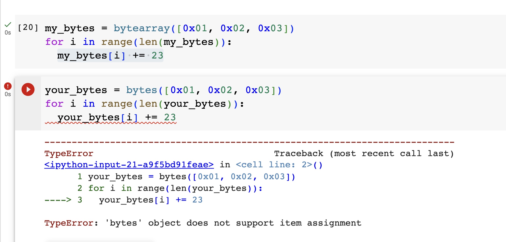
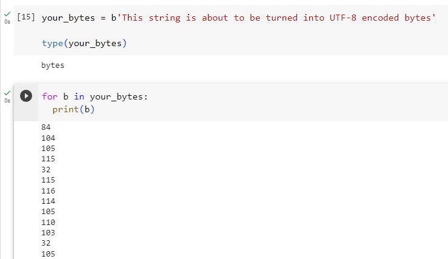

# Handling bytes in Python

Python has two classes for handling byte data -- bytes() and bytearray().

The two classes are similar, but with one crucial difference: bytes() are immutable while bytearray() is mutable.



Also note the quick shortcut way to create a bytes() object from a string:

```
your_bytes = b'This string is about to be turned into UTF-8 encoded bytes'
```



Which shows that ```your_bytes``` is indeed of type bytes() and contains the expected UTF-8 values.
