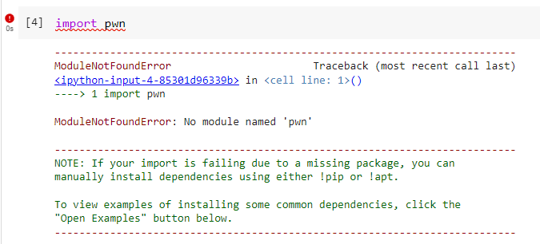

# Extending Colab

Let's say I want to use a library that is not pre-installed on Colab. For example, I want to use the pwntools library to help with a binary CTF challenge. But I run into this issue when I try the import:



You can install pip packages by using the following command:

```
!pip install -q package_name
```

where the -q option means a quiet install.

And there we go! Package is now installed and my Colab instance is that much more powerful!

