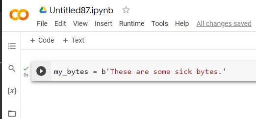

# Interactive Python

While many courses teach you to write Python scripts, don't forget that you can work with Python in an interactive manner. This can be done on the command line or through what is called an interactive Python notebook (.ipynb file extension).

My preferred method for quick work in Python is [Google Colab](https://colab.research.google.com), which is free with a Google account.

Open a *New notebook* from the **File** menu:

There's nothing to configure or do... just start typing your code in the code block.

And then click the play button to execute that code block. A green checkmark shows that it executed properly.

On the left side, you will see a toolbar. If you select the {x} button it will pull up the *Variable inspector* and you can see defined variables and their values.

**IMPORTANT** This is Python running in the cloud. When you are done with this instance it will be wiped and given to someone else. As such, be sure to save your data. Your work, however, is continuously being saved by Colab. If you look at the *File* menu, you will also see options for saving your notebook in Google Drive or Github, or you can download it to your host.

You can pull files into your Python script from your Google drive or, more easily, by clicking on the folder icon on the left. Use the upload button or simply drag files into this mini file manager.

