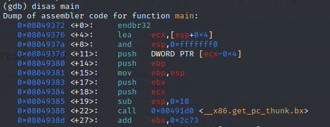

# Quick Disassembly 

Need an address of a function? Open the binary in gdb using:

```
gdb ./vuln
```

To find the section of interest use the disas command:

```
disas main
```



Note the address of the function at the top. Here we see main() starting at 0x08049372.

To quit gdb, simply ```quit```.