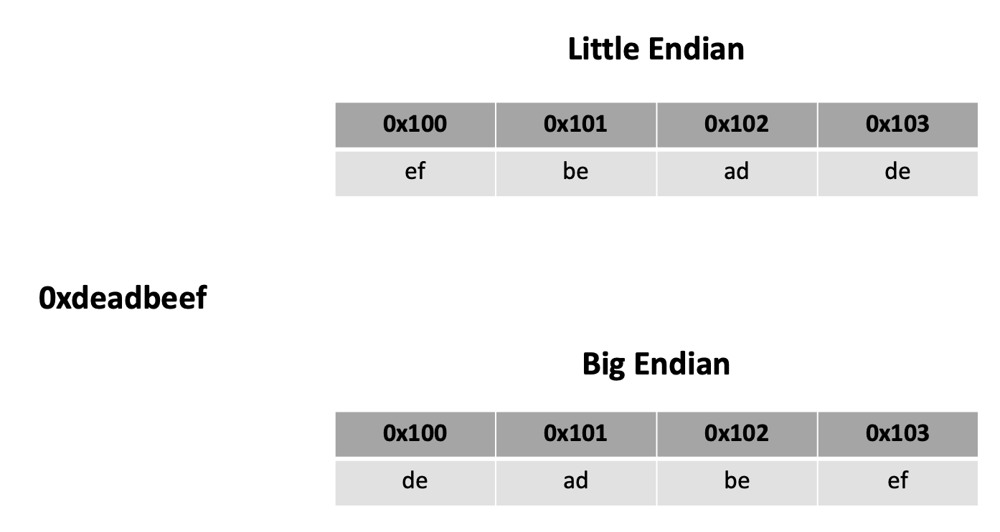
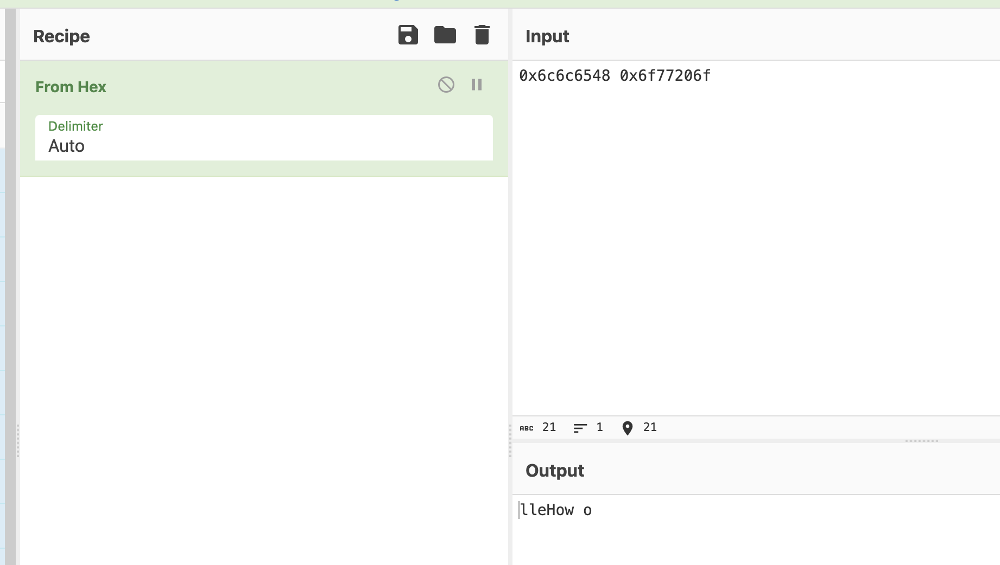
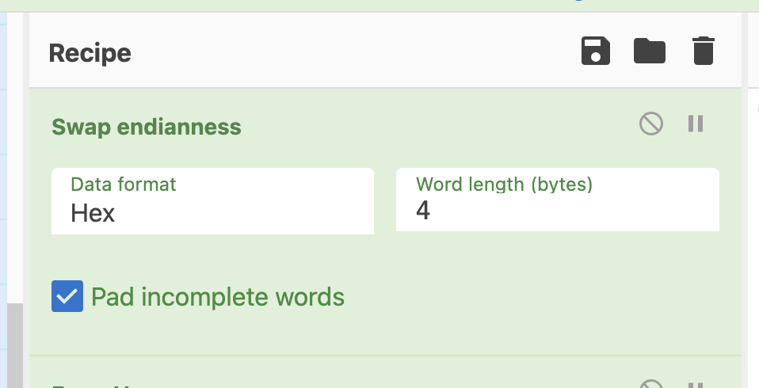
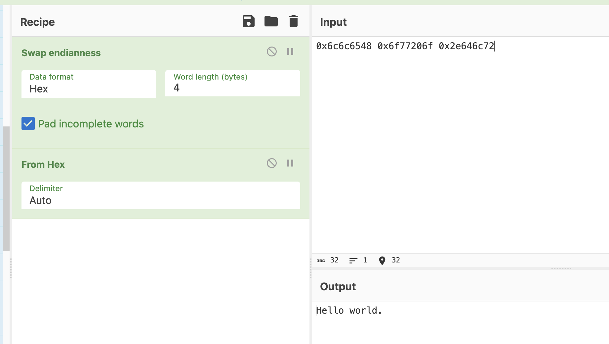

# Endianness: Little Endian vs. Big Endian

Understanding endianness, or how data is stored in memory, is an important skill to have since we deal with so much in binary form. 

In essence, let's look at how a value such as this 32-bit (four byte) integer, 0xdeadbeef, is stored in memory. The two most common ways are little endian and big endian. Let's take a look at how those two approaches differ. Let's say we're storing those four bytes starting at address 0x100.





If you have Ghidra already installed, take a look at [this binary file.](hardcoded)

If not, then follow along with the analysis. After asking Ghidra to analyze the file, you should see the following code segment that it reversed:

```
void main(undefined param_1)

{
  undefined4 local_39;
  undefined4 local_35;
  undefined4 local_31;
  undefined2 local_2d;
  undefined4 local_2b;
  undefined4 local_27;
  undefined4 local_23;
  undefined4 local_1f;
  undefined4 local_1b;
  undefined4 local_17;
  undefined3 uStack_13;
  undefined1 *local_10;
  
  local_10 = &param_1;
  local_2b = 0x74696872;
  local_27 = 0x7b465443;
  local_23 = 0x73696874;
  local_1f = 0x5f73695f;
  local_1b = 0x64726168;
  local_17 = 0x65646f63;
  uStack_13 = 0x7d64;
  local_39 = 0x6c6c6548;
  local_35 = 0x6f77206f;
  local_31 = 0x2e646c72;
  local_2d = 10;
  printf("\n %s",(char *)&local_39);
  return;
}
```

Take a look at the printf() statement near the end. We see the ```%s``` and ```char *```, so it's clear that local_39 is an array of characters, aka a string in C. Yet local_39 has a value of ```0x6c6c6548```.  What happens when you place this hexadecimal value into CyberChef and add *From Hex* to the recipe?


I see some characters, but not sure what it means. Let's try some more.





More characters. But something doesn't look right.


When we analyzed this file with Ghidra, I noticed that it was a 32-bit ELF executable from a little endian processor. Let's go down that road.


Let's swap the endianness of these bytes. And what's the word length?  CyberChef is really asking us how many bytes we expect per memory address -- it's a 32-bit processor, so four bytes. Add the following *Swap endianness* block to the recipe. Be sure to place it before the *From hex* block because we want it working on the raw bytes.





Much better!


Adding in another word yields:



And there it is! Our string is in the clear.