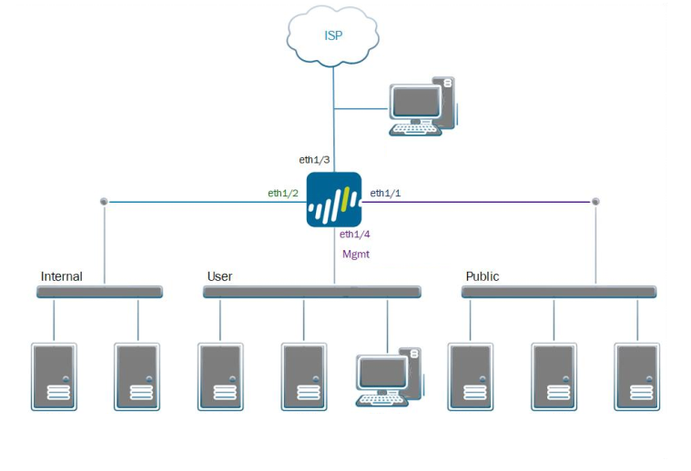

# Week 9

We start pentesting our simulated small office network. 

Your objectives: 

* Set up scope documents before commencing work.
* Can you get into their WiFi network?
* Can you move laterally?
* Find vulnerabilities and exploit them.
* Can you escalate privileges?

