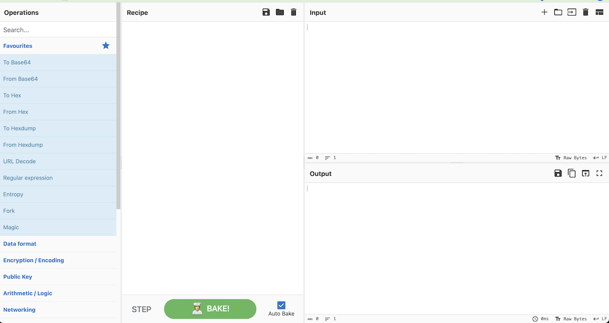
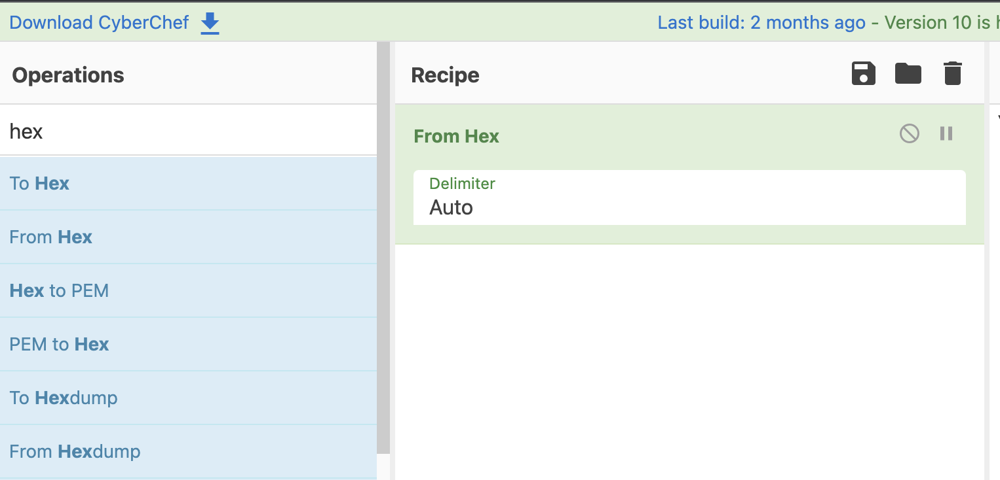
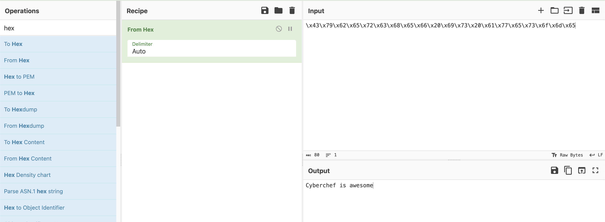

# Cyberchef Example

Here's an example:



On the left you will find a palette with all the different operations possible. You will drag those onto the **Recipe** panel and that will operate on the **Input**, producing your **Output**.

For example, let's say we have the bytes:

```
\x43\x79\x62\x65\x72\x63\x68\x65\x66\x20\x69\x73\x20\x61\x77\x65\x73\x6f\x6d\x65
```

Go ahead and copy those bytes into the **Input** panel of Cyberchef.


Now go over to the left-most palette and search for **hex** since these look like hexadecimal bytes.

Select **From Hex** and drag it on to the **Recipe** panel.



This was a super easy one to solve.

