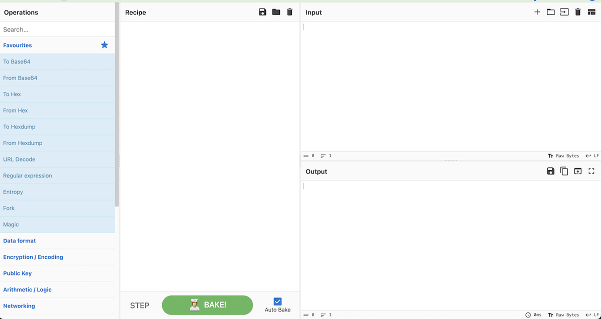

# Cyberchef

Cyberchef is a tool put out by the GCHQ which is "the UK's intelligence, security and cyber agency". It's a web-app that aims to be your go-to tool for hacking data manipulation.

You can find it on the web [here](https://gchq.github.io/CyberChef/) or inside many infosec packages like Security Onion. 

