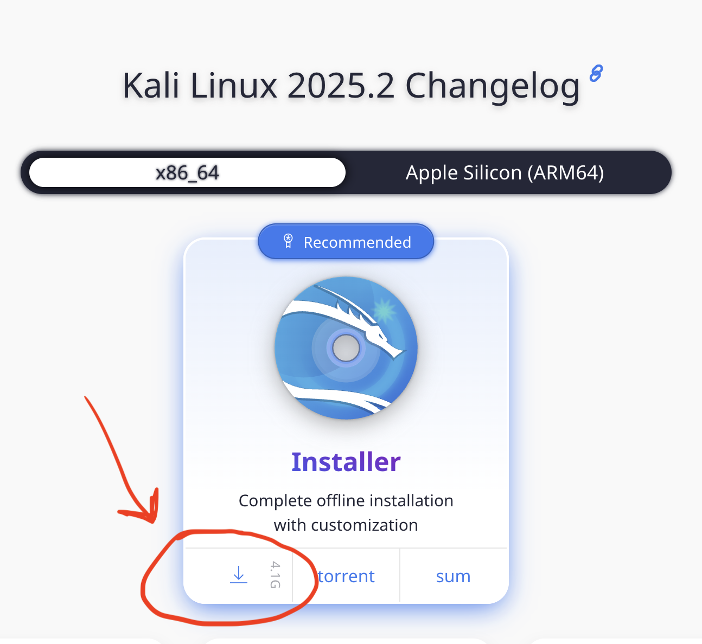

# Installing Kali Linux as a Virtual Machine

## 1. Download the Kali Linux ISO.
 Get it [here](https://www.kali.org/get-kali/#kali-installer-images)

Standard users will want the **x86_64** image.

## 2. Install Kali Linux as a VM
Installation video for Kali Linux on VMware Workstation / Fusion can be found [here](https://rose-hulman.hosted.panopto.com/Panopto/Pages/Viewer.aspx?id=a6dcb021-b1f2-41c9-9f63-b33f00f41236)