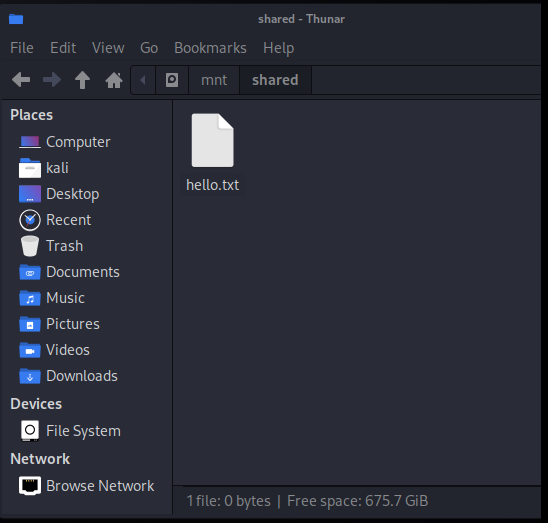

# Creating a shared file space between your host and guest (VM).

## Warning: One of the main reasons we run VMs is to create isolation between our work machine and potentially malicious code. Think hard about the implications of allowing a guest VM access to some of your files.

To create a shared file space between your host and VM, you can use the Settings area of VMware Player and select "Shared Folders".


On your Kali VM, complete the following:

```
sudo mkdir /mnt/shared
```

```
sudo /usr/bin/vmhgfs-fuse .host:/shared /mnt/shared -o subtype=vmhgfs-fuse,allow_other
```

Tweak the line above if you named your share something other than ```shared```. A shared file space is now available at /mnt/shared on your VM.

On Windows:


On Kali:




