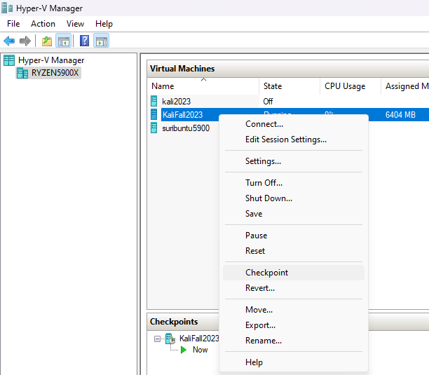
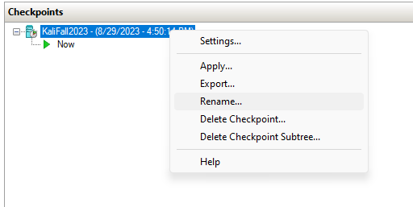

# VM Snapshots

One of the coolest features of VMs is the ability to take "snapshots". You are, in essence, saving the state of a VM at that instant in time. You can then roll back changes to a previous known state whenever needed.

For CTF competitions, a workflow I see quite a bit is:
1. Create a VM and tweak with all the tools you will need.
2. Snapshot the VM.
3. Start a challenge. This may require you to install new software, add new packages to Python, add temporary entries to /etc/hosts, download binaries for reverse engineering, etc.
4. Complete the challenge.
5. Rollback the VM to the pre-challenge snapshot. On to the next challenge!

On Hyper-V, snapshots are known as **Checkpoints**.

On Hyper-V Manager, right click your VM and select Checkpoint.

You will thank yourself later if you rename the checkpoint to something more descriptive.

