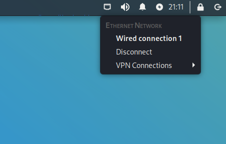

# VPNs

Let's lay out the following scenario:

You have been given permission to assess a specific asset for vulnerabilities, and this asset is connected to the internet. You scan the asset for open ports and find a web server running on port 80. You fire up [gobuster](https://github.com/OJ/gobuster) to identify potential endpoints on the website.

*WARNING: Network traffic of this sort is associated with threat actors. There is a real possibility that your employer or ISP will flag your activities as malicious and take action.*

To remedy this, most CTF labs and cyber ranges will house their vulnerable assets on internal, protected networks. Your network traffic is tunneled through a Virtual Private Network (VPN) while traversing the open internet, only emerging on that protected network. Not only are the vulnerable assets protected, your malicious looking traffic is obscured from the public internet.

In Kali Linux, you can establish VPN connections at the top right corner of the screen.

You will need the VPN information (host name, port, etc.) from the lab manager. This may come in the form of a file that you import.

*WARNING: Most VPNs of this sort are classified as SPLIT TUNNEL networks. Only traffic destined for the private network is tunneled. **All other traffic is sent normally.** Be sure that activities like port scanning, vulnerability scanning, endpoint enumeration, etc. are done only on assets that are part of the private network.*
