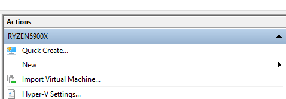
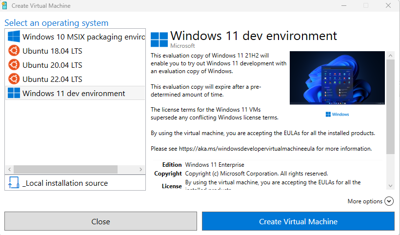

# Creating a quick Windows Machine for Analysis Work

Sometimes you need to create a quick Windows VM for analysis work. Here's one way:

In Hyper-V, select **Quick Create** from the **Actions** panel. 

Then select the **Windows 11 dev environment**. This will create a Windows VM that is ready to go. The best part? All of the Windows stuff (Xbox Live, OneDrive, etc.) that requires you to sign in with an account has been disabled.

